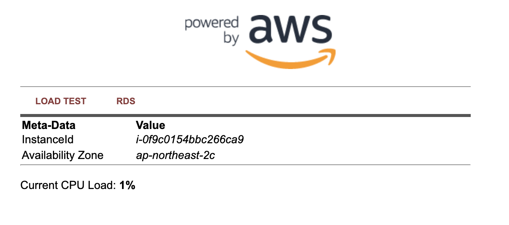
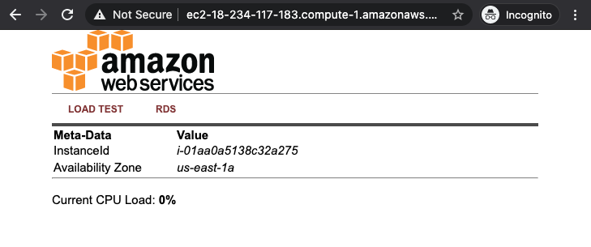

# aws-ec2-lamp-user-data
user data script for EC2 LAMP server 

## Method 1
- Copy the code from below file to user-data
- [ec2-lamp.sh](./ec2-lamp.sh)

  ```
  #!/bin/sh
  ​
  #Install a LAMP stack
  dnf install -y httpd wget php-fpm php-mysqli php-json php php-devel
  dnf install -y mariadb105-server
  dnf install -y httpd php-mbstring
  ​
  #Start the web server
  chkconfig httpd on
  systemctl start httpd
  ​
  #Install the web pages for our lab
  if [ ! -f /var/www/html/immersion-day-app-php7.zip ]; then
     cd /var/www/html
     wget -O 'immersion-day-app-php7.zip' 'https://static.us-east-1.prod.workshops.aws/public/1afe8683-b03d-41b8-b285-726518136bab/assets/immersion-day-app-php7.zip'
     unzip immersion-day-app-php7.zip
  fi
  ​
  #Install the AWS SDK for PHP
  if [ ! -f /var/www/html/aws.zip ]; then
     cd /var/www/html
     mkdir vendor
     cd vendor
     wget https://docs.aws.amazon.com/aws-sdk-php/v3/download/aws.zip
     unzip aws.zip
  fi
  ​
  # Update existing packages
  dnf update -y
  ```

- Sample Output

  

## Method 2

- Add below code to user-data 
  ```
  #include
  https://s3.amazonaws.com/immersionday-labs/bootstrap.sh
  ```
- OR Copy the code from below file to user-data
- [bootstap.sh](bootstarp.sh)
  ```
  #!/bin/sh
  yum -y install httpd php mysql php-mysql
  
  case $(ps -p 1 -o comm | tail -1) in
  systemd) systemctl enable --now httpd ;;
  init) chkconfig httpd on; service httpd start ;;
  *) echo "Error starting httpd (OS not using init or systemd)." 2>&1
  esac
  
  if [ ! -f /var/www/html/bootcamp-app.tar.gz ]; then
  cd /var/www/html
  wget https://s3.amazonaws.com/immersionday-labs/bootcamp-app.tar
  tar xvf bootcamp-app.tar
  chown apache:root /var/www/html/rds.conf.php
  fi
  yum -y update
  ```

- Sample Output

  
## Links
- (ec2-lamp) https://catalog.us-east-1.prod.workshops.aws/workshops/f3a3e2bd-e1d5-49de-b8e6-dac361842e76/en-US/basic-modules/10-ec2/ec2-linux/2-ec2
- (bootstrap.sh)  https://aws-core-services.ws.kabits.com/two-tier-application-linux/ec2/launch-instance/
- https://uploads-ssl.webflow.com/5f1c97b8a30ead7807491ac2/5f899b980a9e9f40924a2d9a_EC2LinuxLab.pdf
- https://github.com/nclouds/immersion-day-basics
